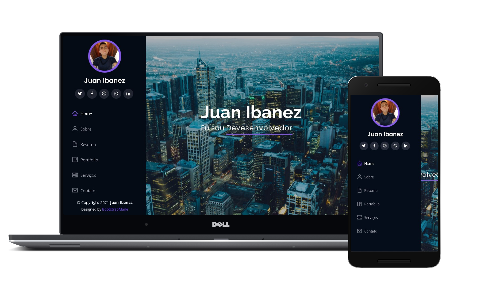

<h1 align="center">
    
</h1>

  <a href="#-tecnologias">Tecnologias</a>&nbsp;&nbsp;&nbsp;|&nbsp;&nbsp;&nbsp;
  <a href="#-projeto">Projeto</a>&nbsp;&nbsp;&nbsp;|&nbsp;&nbsp;&nbsp;
  <a href="#-layout">Layout</a>&nbsp;&nbsp;&nbsp;|&nbsp;&nbsp;&nbsp;
  <a href="#memo-licença">Licença</a>

 

  

 

  

## 🚀 Tecnologias

Esse projeto foi desenvolvido com as seguintes tecnologias:

- [HTML](https://https://www.w3schools.com/html/default.asp/)
- [CSS](https://https://www.w3schools.com/css/default.asp/)
- [Javascript](https://https://www.w3schools.com/js/default.asp/)
- [Bootstrap](https://https://getbootstrap.com/)

## 💻 Projeto

O Portifolio é uma aplicação que serve como um currículo virtual, foi desenvolvido no Bootstrap pages e bastante modificado em sua estrutura por Juan Ibanez💜

## 🔖 Layout

Nos links abaixo você encontra o layout do projeto web. Lembrando que você precisa ter uma conta no [Figma](http://figma.com/) para acessá-lo.

- [Layout Web](https://www.figma.com/file/C6sICQWMCv6UAjtnB1NEwa/Projeto-portifolio?node-id=0%3A1)

## :memo: Licença

Esse projeto está sob a licença MIT. Veja o arquivo [LICENSE](LICENSE.md) para mais detalhes.

---

## 🔗 Projeto

O projeto está disponível em: [portifolio | Juan Ibanez](https://ibanez-juan.github.io/Portifolio-Simplificado/) para acessar online.

Baixe o projeto original em: [bootstrapmade](https://bootstrapmade.com/iportfolio-bootstrap-portfolio-websites-template/) versão gratuita ou paga.

Feito com ♥ by Juan Ibanez!
